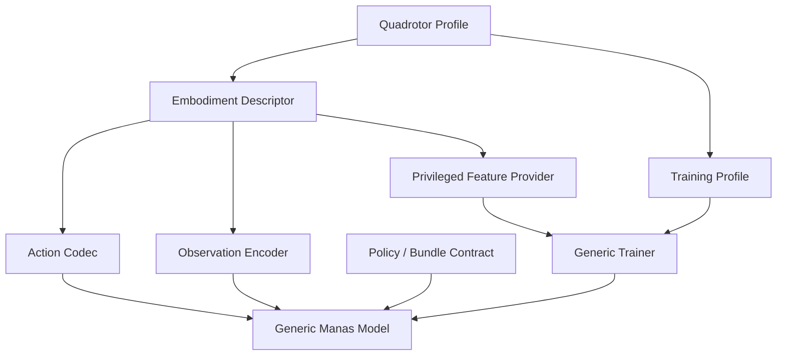
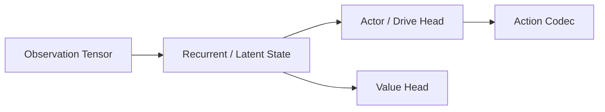
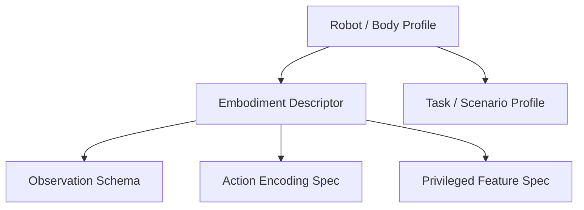
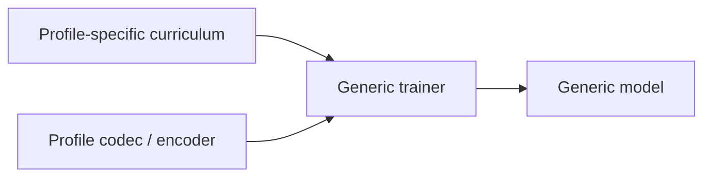
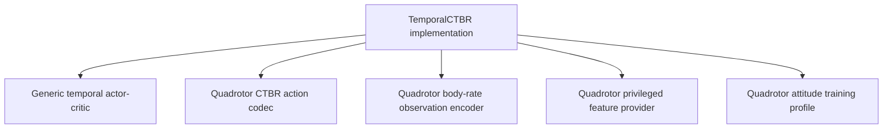

# Manas Model Boundary Guide

This guide defines where generic Manas model logic ends and where robot-specific
specialization begins. It exists to keep Manas usable across robot bodies while
still allowing aggressive optimization for a specific training target such as a
quadrotor attitude task.

## Core Principle

Manas models are generic control models. A quadrotor is one embodiment profile
that supplies descriptors, codecs, encoders, privileged features, and training
profiles to the generic model.

Robot-specific optimization is valid when it is isolated in the descriptor,
codec, encoder, privileged-feature provider, scenario, or training profile. It is
invalid when it changes the meaning of the generic model core.

## Responsibility Map

| Layer | Responsibility | May contain robot-specific semantics? |
|---|---|---|
| Generic Manas model | Encode observation history, maintain recurrent state, emit raw action parameters or bounded drive activations, estimate value when applicable. | No |
| Core / Reflex trainer | Optimize model parameters from typed batches, advantages, losses, masks, and validation signals. | No |
| Policy / bundle contract | Bind model architecture, tensor dimensions, descriptor identity, action encoding identity, observation schema identity, and validation lineage. | Only by identifier |
| Embodiment descriptor | Declare actuator catalogs, sensor catalogs, morphology, limits, timing, and feature availability. | Yes |
| Action codec | Convert raw model output into descriptor-defined drive/action values and validate output ranges. | Yes |
| Observation encoder | Convert descriptor-defined state/sensor streams into model input tensors. | Yes |
| Privileged feature provider | Build critic-only or training-only physical feature vectors from descriptor-owned authority. | Yes |
| Scenario / task suite | Define task goals, safety envelopes, success criteria, seeds, and disturbance schedules. | Yes |
| Training profile | Select curriculum policy, rollout horizons, acceptance gates, recovery relabeling, and profile-specific hyperparameters. | Yes |
| Reference fixture | Provide known-good robot constants and test assets. | Yes, but only as an explicit fixture |

## Generic Model Contract

A generic Manas model may depend on shapes and typed contracts, but not on the
physical meaning of individual robot channels.

Allowed in the generic model:

- Tensor ranks, dimensions, and batch/history layout.
- Recurrent architecture choices such as GRU, RSSM, or shared token encoders.
- Generic output transforms declared by a typed action specification.
- Value estimation over actor observations plus privileged features.
- Finite-value, mask, bootstrap, and continuation semantics.

Not part of the generic model:

- A specific actuator count as a model invariant.
- A hard-coded action channel meaning such as collective thrust or body rates.
- A hard-coded observation layout such as Euler angles plus velocity.
- A hard-coded physical parameter source such as reference quadrotor mass or inertia.
- Task-specific safety thresholds or curriculum horizons.

## Robot-Specific Specialization Contract

Robot-specific behavior must enter through explicit profile components.

For a quadrotor profile, these components may define collective thrust, body-rate
channels, motor constants, inertia, body-frame conventions, altitude-hold
teacher behavior, and attitude safety envelopes. Those meanings must remain in
the quadrotor profile and its codecs, not in the generic actor-critic.

## Implementation Placement Guide

Use this table when adding or moving code.

| New logic | Correct owner |
|---|---|
| A new neural architecture block | `ManasMLXModels` |
| A loss, GAE rule, bootstrap mask, or PPO batch rule | Generic training backend |
| A tensor shape derived from a policy contract | Policy/batch config |
| A channel transform from raw actor output to actuator intent | Action codec |
| A sensor/state packing layout | Observation encoder |
| A critic-only physical vector | Privileged feature provider |
| A task pass/fail rule | Scenario or acceptance policy |
| A horizon schedule or recovery relabeling policy | Training profile / curriculum controller |
| A reference robot constant | Reference fixture or descriptor |

If code needs a robot name to be correct, it does not belong inside the generic
model. If code needs only dimensions, masks, and typed transform specs, it may
belong inside the generic model.

## Training Optimization Rule

Training may be heavily optimized for a specific target. The optimization must
declare which profile it belongs to and must preserve generic model semantics.

Valid profile-specific optimization:

- A quadrotor attitude curriculum that emphasizes long-horizon hover stability.
- A quadrotor recovery relabeler that asks a quadrotor teacher for recovery
  actions.
- A quadrotor action codec that constrains thrust and body-rate channels
  according to its descriptor.
- A scenario-specific acceptance rule that compares support and frontier
  horizons using task-owned metrics.

Invalid placement:

- Making the actor assume action index `0` is thrust.
- Making a generic loader require exactly four actions.
- Making a generic critic feature provider read reference quadrotor constants.
- Making a generic checkpoint family imply a single robot body.

## Compatibility Policy

Boundary corrections should prefer correctness over backward compatibility.
Keeping a deprecated wrapper is acceptable only when it still preserves the
generic/profile split. A wrapper that hides robot-specific semantics behind a
generic name must be deleted.

| Case | Required action |
|---|---|
| Old code calls a generic type that actually assumes a robot body. | Break the call site and move it to a profile-owned type. |
| Old checkpoints omit profile schema identities. | Regenerate or explicitly migrate them; do not silently load them. |
| Old validators encode one robot's action layout as a global rule. | Delete the rule and move it to the profile validator. |
| Old names hide specialization, such as generic `TemporalCTBR` model names. | Rename or split so the generic type and profile type are visibly distinct. |

Compile-time breakage is preferred to keeping an ambiguous implementation path.

## Naming Guide

Names must communicate whether a type is generic or profile-specific.

| Kind | Naming pattern |
|---|---|
| Generic model | `ManasMLXTemporalActorCritic`, `ManasMLXCore`, `ManasMLXReflex` |
| Generic contract | `ActionEncodingSpec`, `ObservationSchema`, `PrivilegedFeatureSpec` |
| Profile implementation | `QuadrotorCTBRActionCodec`, `QuadrotorBodyRateObservationEncoder` |
| Reference fixture | `ReferenceQuadrotorProfile`, `ReferenceQuadrotorFixture` |
| Task profile | `QuadrotorAttitudeTrainingProfile` |

Profile names are allowed and expected in profile-owned code. They should not be
hidden behind generic names, because hidden specialization is harder to review.

## Review Checklist

Before merging model or training changes, reviewers should answer these
questions.

| Question | Expected answer |
|---|---|
| Does the generic model know a robot-specific action meaning? | No |
| Does the trainer require a fixed actuator count without consulting a contract? | No |
| Does the loader rebuild observation tensors through a named encoder? | Yes |
| Are physical constants read from a descriptor or profile-owned provider? | Yes |
| Can a second robot add a codec/encoder/profile without changing the model core? | Yes |
| Are task thresholds owned by scenarios or profiles rather than model code? | Yes |
| Does the checkpoint identify descriptor and encoding IDs explicitly? | Yes |

## Migration Guidance for Existing CTBR Code

Existing temporal-CTBR code should be treated as a quadrotor-optimized profile
running on a generic temporal actor-critic backend.

The migration target is not to remove quadrotor optimization. The target is to
move quadrotor meaning into profile-owned components so that the backend model
can train other robot profiles through the same contracts.

Required direction:

1. Move action output squashing from actor hard-coding into an action codec.
2. Move fixed action-count validation from model config into codec/profile
   validation.
3. Move observation reconstruction into a named observation encoder.
4. Move privileged physical parameters into a descriptor-backed provider.
5. Keep GAE, PPO, BC, terminal semantics, recurrent model logic, and checkpoint
   integrity generic.

## Authority

This guide refines the boundaries defined by `SPEC.md` and `MLX_MODEL_SPEC.md`.
When implementation choices are ambiguous, preserve this ownership rule:

> Generic model code owns learning architecture. Robot profiles own physical
> semantics.
