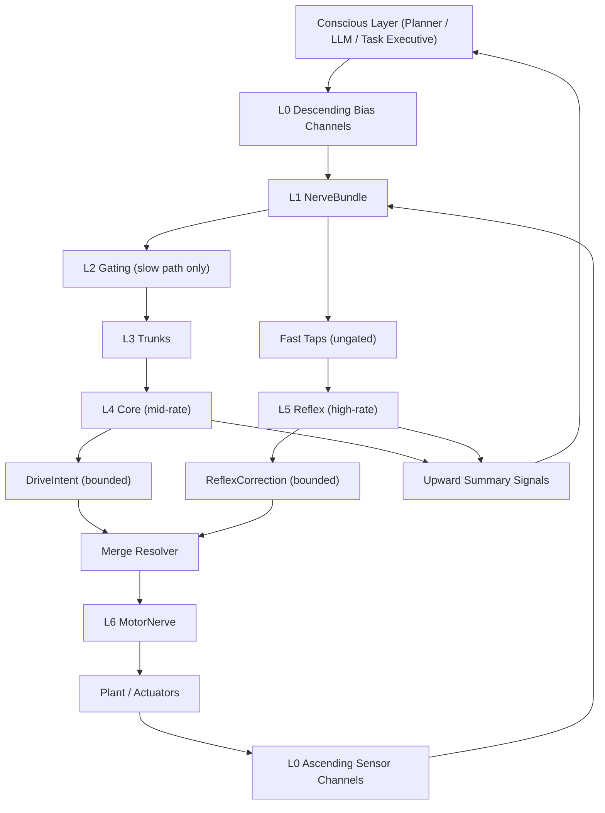

# Manas Specification

This document is the authoritative normative specification for Manas.

## Definition (Normative)
Manas is a **learnable CNS‑style control protocol** with layered structure:
**NerveBundle → Gating → Trunks → Core + Reflex → MotorNerve → Plant**.
It targets same‑type swappability and stable closed‑loop control.
All layer responsibilities listed below are **mandatory**.

## Design Principle (Normative)
The body/plant is part of the computation. Physical dynamics, morphology, and
embedded compliance are treated as **computational resources** that Manas
learns to exploit. Optimal mappings (MotorNerve and primitives) are therefore
**morphology‑dependent**, and Manas must adapt to each robot’s neural and
physical structure.

## Scope
Includes protocol layers, interfaces, learning boundaries, and safety constraints.
Excludes plant dynamics, simulation mechanics, and UI.

## Architecture Baseline (Normative)
- `MANAS_NERVE_NETWORK_DESIGN.md` is the canonical baseline for Manas
  nerve-network architecture updates.
- This document defines stable protocol invariants and constraints.
- If an architecture detail conflicts, `MANAS_NERVE_NETWORK_DESIGN.md` takes precedence
  and this spec must be updated accordingly.

## Module Separation (Normative)
Manas is delivered as separate modules:
- **ManasCore**: protocol layers and data types (NerveBundle/Gating/Trunks/Core/Reflex/MotorNerve).
- **ManasRuntime**: configuration + logging for runtime execution.
- **manas**: umbrella target that re‑exports Core + Runtime for convenience.

Training modules (e.g., MLX optimization) are **not required** for model delivery.
Optional MLX modules:
- **ManasMLXModels**: MLX Core/Reflex models.
- **ManasMLXRuntime**: MLX‑backed Core/Reflex controllers.
- **ManasMLXTraining**: training pipeline (not shipped with model).

## Layered Architecture (Normative)
- **L0 Ascending channels**: raw multi‑channel sensor streams.
- **L0 Descending channels**: optional upper-layer intention/context **bias** streams.
- **L1 NerveBundle**: convergence, normalization, local transforms, routing.
- **L2 Gating**: continuous, reflex‑safe gating of ascending streams (slow path only).
- **L3 Trunks**: abstract streams (Energy / Phase / Quality / Spike).
- **L4 Core**: learnable mid‑timescale control.
- **L5 Reflex**: learnable micro‑controllers for HF stabilization.
- **L6 MotorNerve**: actuator mapping (no hard safety filter).

## Inputs / Outputs
- Inputs: ascending + descending signal streams (not discrete command vocabulary).
- Outputs: bounded **DriveIntent** command activations.
- DriveIntent semantics are descriptor-defined and may be primitive-oriented or
  actuator-typed depending on morphology profile.
- Reflex outputs: clamp/damping/micro‑intent applied before MotorNerve.
- Descending channels are treated as **bias/priority/context modulation**, not
  mandatory direct actuator directives.

## Learning (Normative)
- **Allowed and required** in **Core** and **Reflex** for swappability.
- MotorNerve is **not** a learning location; safety is learned in Core/Reflex.
- MotorNerve parameters are **morphology‑dependent** and may be calibrated per body.
- Shared encoder/decoder adaptation and LoRA are valid when they belong to Core/Reflex
  model parameters and preserve the MotorNerve protocol boundary.

## MLX Model Reference
See `MLX_MODEL_SPEC.md` for the MLX Core/Reflex reference architecture and training phases.

## Model Bundle Contract (Normative)
Manas model delivery is a **model bundle**, not a standalone weight file.
A bundle MUST contain a `manas-bundle.json` manifest that binds executable
model components to the runtime contract required to use them safely.

Minimum bundle responsibilities:
- identify the bundle with `bundleID`, `schemaVersion`, and creation time,
- bind descriptor identity, configuration identity, observation schema, drive
  semantics, and optional MotorNerve profile,
- reference required model components such as `modelConfig` and `coreWeights`,
- reference optional components such as Reflex weights, world-model weights,
  normalization stats, safety envelope, lineage, and validation artifacts,
- validate component paths as safe relative paths,
- validate required files, byte counts, and component digests when present,
- preserve multi-rate constraints when core/reflex periods are included.

Kuyu may attach training, regression, and acceptance artifacts to a Manas bundle,
but those artifacts do not make Kuyu the owner of Manas model internals.
The executable model contract remains in Manas.

## Safety & Stability
- Safety dominates performance (learned safety, no hard filter).
- Reflex must not be fully blocked by Gating (fast path is ungated).
- DriveIntent is always bounded and fixed‑length.
- Descending integration must not violate reflex-safe gating or multi-rate guarantees.
- CMI is **separable**: Manas must remain stable if CMI is absent or disconnected.
- When present, CMI cannot override Reflex or MotorNerve mapping.

## Robotics + NN Integration Mechanisms (Normative)
The following mechanisms are required to realize Manas as a robotics-native
neural control protocol:
- **Descriptor-driven semantics**: channel types and command semantics MUST be
  resolved from RobotDescriptor (ascending/descending/drive/actuator catalogs).
- **Timestamp-aware ingestion**: NerveBundle MUST handle asynchronous samples,
  delay penalties, and missing-sample robustness without NaN/Inf propagation.
- **Guaranteed multi-rate execution**: Core/Reflex cadence separation and
  hold semantics MUST be preserved under jitter and partial sample loss.
- **Constraint-aware command shaping**: bounded outputs, non-overwriting reflex
  corrections, and morphology-consistent mapping MUST hold for every step.
- **Telemetry feedback path**: actuator telemetry and safety traces MUST be
  available to control stages that require real hardware state awareness.
- **Adaptive context integration**: descending channels and morphology/context
  vectors MUST be supported without breaking reflex-safe fast paths.
- **Controlled parameter adaptation**: LoRA/shared-model adaptation MUST be
  scope-limited to Core/Reflex model parameters with deterministic rollback paths.
- **Step-level observability**: each run MUST be reconstructable from logs for
  NerveBundle/Gating/Trunks/Core/Reflex/MotorNerve state transitions.
- **Reproducible training contract**: scenario seed, config hash, descriptor
  identity, and model identity MUST be bound to every training/eval artifact.

## Signal Contract (Normative)
Manas adheres to the shared signal contract in `SIGNAL_CONTRACT.md`.
All inputs and internal streams must respect finite values, monotonic timestamps,
and catalog indices. Missing samples are represented by absence, not NaN.

## Time Contract (Normative)
Manas adheres to the shared time contract in `TIME_CONTRACT.md`.
Core and Reflex periods must be finite, positive, and Reflex must be faster.
When Core or Reflex does not update, the last output is held.

## CMI (Optional)
Non‑linguistic, low‑bandwidth latent interface for co‑resident reasoning systems.
CMI is optional but **cooperation is allowed** when present; Manas must function without it.
Not required for M1.

## Conscious/Unconscious Loop (Normative)
Manas models the unconscious execution layer and supports bidirectional interaction
with an external conscious/planning layer:
- **Unconscious execution domain**: real-time stabilization, reflexive correction,
  and continuous motor command shaping are handled inside Manas.
- **Conscious influence domain**: external systems (planner/LLM/task executive)
  influence Manas via descending bias channels (goal, priority, inhibition, context).
- **Bottom-up signaling domain**: Manas MUST be able to expose upward summaries
  (salience, failure risk, uncertainty, constraint pressure, recovery state) for
  conscious-layer interpretation and decision updates.
- **Precedence rule**: safety-critical reflex behavior MUST preempt conflicting
  descending bias when immediate stabilization is required.
- **Timescale rule**: unconscious control loops run at high frequency; conscious
  updates are lower-frequency and must not break multi-rate guarantees.

## Bidirectional Control Flow (Normative)
The runtime control flow must preserve this directionality and precedence:

- Descending channels enter as modulation/bias and must not bypass Core/Reflex.
- Gating applies only to the slow path; reflex fast taps remain ungated.
- Merge resolution MUST apply reflex-safe precedence before MotorNerve mapping.

## Conscious Interface Contract (Normative)
Manas-to-conscious and conscious-to-Manas exchanges are typed channel contracts:
- Descending input MUST be represented as typed scalar channels declared in descriptor catalogs.
- Upward summary output MUST be represented as typed scalar summary channels
  declared in descriptor/runtime catalogs with stable indices.
- Descending channels SHOULD cover at least: goal bias, priority/urgency, inhibition/permissive context, and optional latent context embedding.
- Upward summaries MUST include at least: `salience`, `risk`, `uncertainty`, `constraintPressure`, and `recoveryState`.
- Upward summaries MUST be finite, timestamped, and aligned to the shared time contract.
- Missing descending input MUST degrade to stable hold behavior, not undefined control.

## Arbitration and Precedence (Normative)
Control arbitration must follow this order every runtime step:
1. Validate ascending/descending finiteness and timestamp ordering.
2. Compute Core proposal (or hold prior output when Core does not update).
3. Compute Reflex correction from fast taps.
4. Apply Reflex correction as bounded non-overwriting modification to DriveIntent.
5. Resolve conflicts by prioritizing immediate stabilization over conflicting descending bias.
6. Map through MotorNerve to actuator values while preserving boundedness and continuity.

## Functional Analogy Allocation (Informative)
This is a functional analogy map for understanding and review, not anatomical identity.

| Neuro Function (Analogy) | Consciousness Relation | Primary Role | Manas / Surrounding Components |
|---|---|---|---|
| Spinal-like | Unconscious dominant | Fast sensor-motor loop, immediate stabilization | `NerveBundle` fast path, `Reflex`, `MotorNerve` |
| Cerebellar-like | Unconscious dominant | Micro-correction, timing/coordination tuning, adaptation | `Reflex` models and adaptation modules in Core/Reflex runtime |
| Basal-ganglia-like | Mostly unconscious selection | Action tendency shaping and selection pressure under context | `Gating` + descending bias integration in Core |
| Cortical-like | Conscious dominant | Goal/context interpretation and strategy updates | External planner/LLM/conscious layer via descending channels |
| Ascending feedback to conscious layer | Bridge (unconscious -> conscious) | Report salience/risk/uncertainty for reinterpretation | Manas runtime summaries exported upward |

Practical interpretation:
- Conscious layer sends bias/context, not direct low-level actuation.
- Unconscious control in Manas keeps real-time stabilization authority.
- Safety-critical reflex behavior preempts conflicting high-level bias.

## Notes on Neural Tract (Future)
Neural Tract is acknowledged as a future concept only; no conformance rules in this spec.

## Mandatory NerveBundle Responsibilities (Normative)
NerveBundle must implement all of the following:
- **NB1 Spatial convergence**: receptive‑field or channel grouping; produce fixed‑dimensional features.
- **NB2 Nonlinear transduction**: saturation/compression for robustness.
- **NB3 Lateral inhibition**: local contrast or anomaly emphasis.
- **NB4 Gain control / normalization**: divisive normalization with stable statistics.
- **NB5 Temporal filtering**: at least one slow path and one fast path.
- **NB6 Routing**: slow path feeds Core (features), fast path feeds Reflex (fastTaps).
Reflex executes on the NerveBundle fast path and does not require Core to update.

## Fixed NerveBundle Parameters (Normative)
Quality estimation and temporal shaping use fixed constants:
- `qualityFloor = 0.2`
- `transductionGain = 2.0`
- `slowTau = 0.05 s`
- `fastTau = 0.005 s`
- `normalizationTau = 0.2 s`
- `lateralInhibitionStrength = 0.2`
- `delayPenaltyPerSecond = 0.2`
- `missingPenalty = 0.5`
- `deltaPenalty = 0.1`
- `normalizationEpsilon = 1e-6`

## Mandatory Gating Constraints (Normative)
- Gating is **continuous** (no discrete modes).
- Gating is **reflex‑safe**: fast path is never gated off.
- Gate factors are bounded in `[minGate, maxGate]` with `minGate > 0`.

## Multi‑Rate Execution (Normative)
Manas must enforce distinct update periods:
- **Reflex** updates at the fast rate.
- **Core** updates at a slower rate.
When Core does not update, the last DriveIntent is held.

## Reflex Boundary (Normative)
Reflex is a bounded correction layer and must obey strict constraints:
- Corrections only modify existing DriveIntent channels.
- `clampMultiplier` and `damping` must remain in `[0, 1]`; `delta` must be finite.
- Reflex must not create or remove DriveIntent channels.
- Reflex must not implement a hard safety filter or override MotorNerve.

## Trunks (Normative; Minimum Definition)
- **Energy**: non‑negative magnitude of gated features.
- **Phase**: signed/phase‑bearing components of gated features.
- **Quality**: sensor reliability estimates.
- **Spike**: fast‑path magnitude indicators.

## DriveIntent (Normative)
- Fixed length for the target plant.
- Continuous and bounded; all outputs are clamped before MotorNerve.
- Descriptor-defined semantics: primitive-oriented or actuator-typed command channels.

## Primitive Representation (Normative)
- DriveIntent is a vector of **motor‑primitive activations**.
- DriveIntent may include **optional continuous parameters** per primitive.
- Primitive semantics are defined by the **body/MotorNerve descriptor**, not globally.
- The primitive bank may be **hierarchical** (task‑level → allocation → actuator).
- Primitives are designed to exploit **body dynamics** (inertia, compliance, coupling).
- For profiles that use actuator-typed command channels, the same descriptor rule applies:
  semantics are still body-local and enforced through MotorNerve mapping contracts.

## MotorNerve (Normative)
- The **MotorNerveEndpoint** maps **DriveIntent (+ Reflex corrections)** to actuator values.
- MotorNerve may be **multi‑stage** internally; intermediate stages map MotorNerve signals.
- MotorNerve is **morphology‑dependent** and must preserve boundedness/continuity.
- MotorNerve must not implement a hard safety filter.
- MotorNerve may be an identity-style endpoint for direct actuator-typed profiles,
  but the protocol boundary remains explicit.
